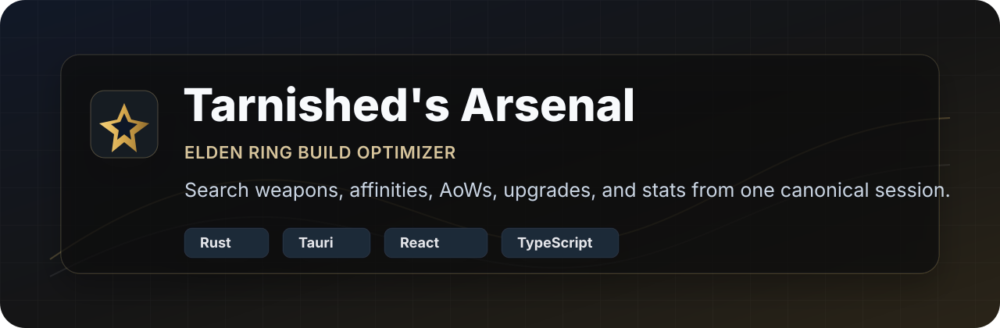
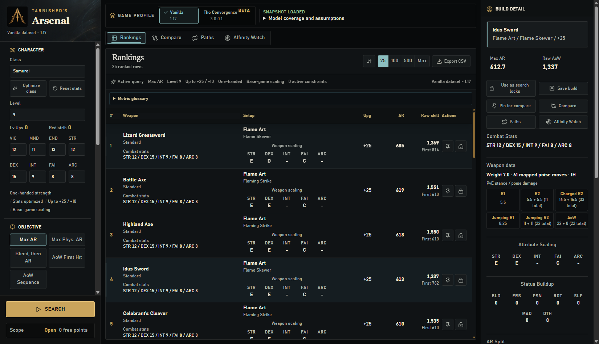

<p align="center">
  
</p>

# Tarnished’s Arsenal

[](https://github.com/FueledByRedBull/tarnisheds-arsenal/actions/workflows/ci.yml)
[](https://github.com/FueledByRedBull/tarnisheds-arsenal/actions/workflows/release-package.yml)
[](https://github.com/FueledByRedBull/tarnisheds-arsenal/releases/latest)

**Tarnished’s Arsenal** is a Windows desktop optimizer for Elden Ring builds. It
performs a Rust search across weapons, affinities, Ashes of War, upgrade
levels, and relevant stat distributions, then carries one versioned build session
through rankings, comparisons, stat paths, affinity breakpoints, exports, and presets.

Choose a class, level, objective, and constraints; inspect or lock a ranked build;
then answer follow-up questions without rebuilding the assumptions.

> Fan-made tooling, unaffiliated with FromSoftware or Bandai Namco Entertainment;
> it does not include or distribute Elden Ring.

## Download

Get the latest Windows build from [Releases](https://github.com/FueledByRedBull/tarnisheds-arsenal/releases/latest).

- `TarnishedsArsenal_<version>_x64_en-US.msi` is the standard installer.
- `TarnishedsArsenal_<version>_portable.exe` is the standalone app.
- `TarnishedsArsenal_<version>.zip` bundles the complete release folder for archival
  or offline transfer.

The app uses Microsoft Edge WebView2. The MSI downloads its bootstrapper if needed;
the portable executable expects WebView2 to already be installed. The installer and
portable executable include checksummed Vanilla 1.17 and Convergence 3.0.0.1
profiles. Each release publishes SHA-256 checksums plus a machine-readable build
report. The standalone app
needs no adjacent data directory, `regulation.bin`, workbook, or FMG files.

## What It Answers

- What is best if `ARC` must stay above 40?
- When does `Occult` overtake `Blood`?
- Which stat does the greedy selected-target preview add next?
- Which affinity wins when weapon, Ash of War, class, and level budget stay fixed?
- What happens when the same build is evaluated at every upgrade level?
- In Vanilla, how does Shadow Realm Scadutree scaling change outgoing damage?

The five supported objectives are:

- `Max AR`
- `Max Physical AR`
- `Bleed, then AR`
- `AoW First Hit (PvE)`
- `AoW Full Sequence (PvE)`

## Interface

Select a ranking row to make it the active build.<br>
Build Detail shows combat stats, AR split, route damage, status, stamina, and warnings.<br>
Compare, Paths, and Affinity Watch reuse that active session.<br>
The active-query strip keeps objective, level, reinforcement, handedness, profile, and constraints visible.<br>
CSV export offers 25, 100, 500, and 2,000-row limits with model and profile provenance.



## Model Details

### Search model

The optimizer searches legal combinations while each major constraint can be locked
or opened:

| Input | Locked | Open |
|---|---|---|
| Weapon type | One family | All families |
| Weapon | One weapon | All weapons |
| Affinity | One affinity | All legal affinities |
| Ash of War | One skill | All legal skills |
| Upgrade | Exact `+N` | Full `+0..+N` range |
| Combat stats | Exact locked result | Optimize within the session budget |

Selecting a weapon starts with its native skill when legal for the chosen affinity.
In Rankings and Compare, changeable weapons offer **Automatic (best legal skill)**;
fixed skills show their name in a disabled **AoW (fixed)** field. Explicit choices,
including Automatic, survive reopening a workspace or restoring inputs. Buckler's
native skill is **Buckler Parry**; **No Skill** is a separate legal override.

All five objectives use a bounded lexicographic dynamic program over relevant combat
stats, including numeric tie-break dependencies. Weapon requirements become minimum
floors first; every feasible active-stat spend is compared after deterministic
inactive-stat completion.

The recurrence is exact under exact arithmetic and the documented model assumptions.
The implementation uses `f32`, so sufficiently close intermediate comparisons can
discard the allocation preferred by exhaustive evaluation, even after terminal
metrics are recomputed. See the [mathematical scope](docs/design/optimizer-math.md#7-scope-of-the-claims)
and [numerical evidence](docs/design/optimizer-overview.md#numerical-evidence-and-decision).

AoW damage objectives evaluate one legal route at a time. Inspector and Compare expose
the selected route’s ordered actions and hits, damage, status buildup, physical-hit
attribute, buff timing, stamina, and modeling warnings.

### Data and profiles

Runtime snapshots are generated from local game and mod data, FMG names, and workbook
extraction. They cover weapon affinities, reinforcement, scaling graphs, AoW
compatibility and routes, innate and upgrade-dependent passives, skill attack data,
effect graphs, paired and two-hand behavior, and Shadow of the Erdtree attack scaling.

Snapshots use **schema 4**: mounting permission and Ash affinity/type lists are the
single source of compatibility. Schema-3 snapshots are rejected before CSV loading;
regenerate them with the current extractor rather than relabeling their manifests.

Each profile is independent, versioned, and checksummed. Missing, modified, mixed, or
unlisted files fail closed instead of loading data from another profile.

### Convergence 3.0.0.1 beta

The Convergence profile is experimental. A version-bound reference checks weapon
availability, base attack, requirements, raw scaling, affinities, and base status.
Those checks do not independently verify final AR mechanics or customization legality.
Convergence evaluates the exact combat stats entered under **Custom stats**. The
displayed stat total is not a Rune Level: starting-class budgets, class optimization,
Compare, Paths, and Affinity Watch are disabled until a version-pinned class catalog
is verified. Vanilla class rules are never substituted for the mod's classes.
Ammunition weapon AR is excluded until arrow, bolt, and projectile damage are modeled;
Ash of War hit and route damage is disabled until mod-specific motion and sequence data
is mapped. Vanilla data is never substituted. Broader in-game verification remains in
progress, while the application itself remains a stable release.

Its profile rules use one weapon reinforcement path from `+0` through `+15`, remove
Scadutree Blessing scaling, keep weapon status fixed across stats and upgrades, expose
extended `S+`/`S++` grades, and apply every declared nonzero attribute scaling to every
nonzero damage component for row-0 attack-element weapons.

### Current model boundaries

- Enemy defense, negation, resistance growth, and proc explosion damage are not
  modeled. Raw PvE poise/stance values are reported for supported weapon attacks and routes.
- Route status details cover bleed, frost, poison, scarlet rot, sleep, madness, and
  death buildup separately from proc damage.
- Route stamina is reported but is not an optimization objective.
- Temporary buff stacking is not modeled as a universal layer.

## For Contributors

Report bugs through [GitHub Issues](https://github.com/FueledByRedBull/tarnisheds-arsenal/issues).
Include the app version, game profile, reproduction steps, and expected versus actual
results. For security issues, use the private channel in [SECURITY.md](SECURITY.md).

Submit focused pull requests against `main`. Explain the problem and the checks run,
follow the existing code style, and add a regression test for behavior changes.
Keep raw game files, credentials, build output, and local audit reports out of commits.

The Rust core lives in `core/er_optimizer_core`, and the desktop in `apps/desktop`.
`tools/phase1` handles extraction; `tools/phase4` handles validation, benchmarks, and
releases. The phase names are historical: phases 2 and 3 became the core and desktop.

### Requirements

- Rust 1.97.0 with `clippy` and `rustfmt` (pinned by `rust-toolchain.toml`)
- Node.js 22.23.1 with npm (pinned by `.node-version`)
- Python 3.12.10 for validation and data tooling (pinned by `.python-version`)

Install Python validation helpers for data validation or release packaging:

```powershell
python -m pip install -r requirements-validation.txt
```

### Run and validate

```powershell
cd apps/desktop
npm ci
npm run tauri dev
```

`npm run tauri dev` is the preferred desktop command: Tauri’s `beforeDevCommand`
starts Vite. `npm run dev` is the frontend-only alternative.

```powershell
cargo test --manifest-path core/er_optimizer_core/Cargo.toml
cargo test --manifest-path apps/desktop/src-tauri/Cargo.toml
python tools/phase4/validate_phase4.py
cd apps/desktop
npm test
npm run build
npm run test:e2e
```

### Release and data

Build a Windows release package with:

```powershell
python tools/phase4/package_release.py
```

The helper produces the MSI, portable executable, checksums, build report, and ZIP;
see the [release guide](docs/releasing.md) for the tag-driven process. See the [phase 1
tooling guide](tools/phase1/README.md) to refresh versioned data snapshots.

More references: [optimizer design](docs/design/optimizer-overview.md),
[optimizer mathematics](docs/design/optimizer-math.md),
[runtime invariants](docs/architecture/runtime-invariants.md), [performance guide](docs/performance.md),
[release notes](docs/release-notes/README.md), and [CHANGELOG](CHANGELOG.md).

## License

Code is available under the [MIT License](LICENSE).
