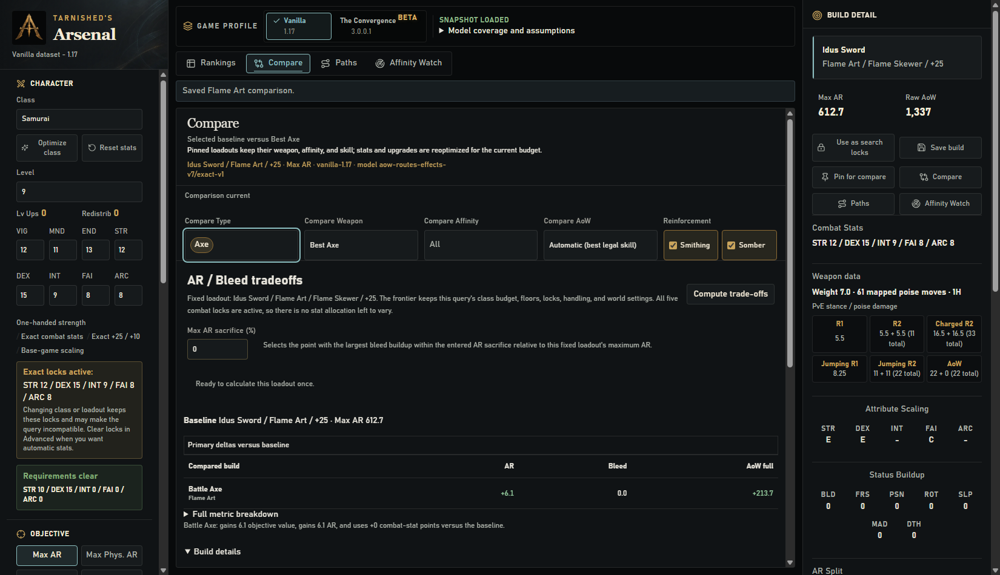
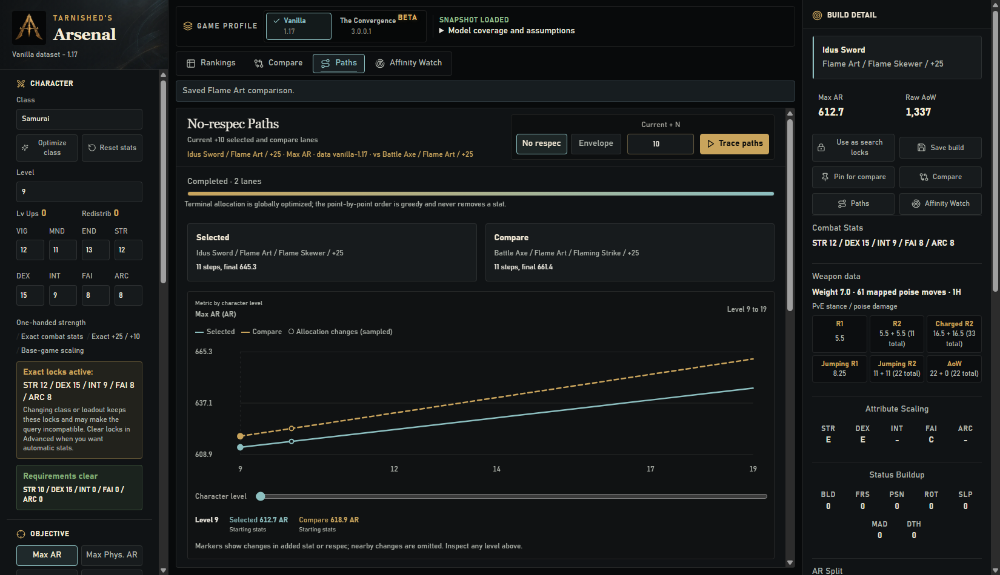
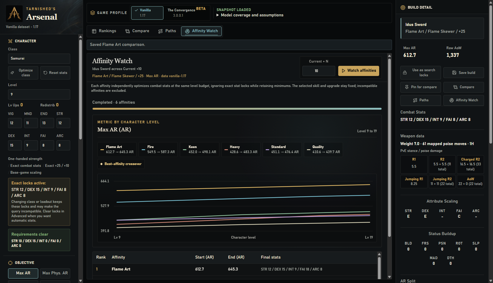

<p align="center">
  
</p>

# Tarnished’s Arsenal

**Find your weapon. Compare your options. Plan your next levels.**

A Windows desktop build optimizer for Elden Ring. Search weapons, affinities,
Ashes of War, upgrades, and combat stats, then carry a selected build into
comparisons and progression previews.

[](https://github.com/FueledByRedBull/tarnisheds-arsenal/actions/workflows/ci.yml)
[](https://github.com/FueledByRedBull/tarnisheds-arsenal/releases/latest)

**[Download for Windows](https://github.com/FueledByRedBull/tarnisheds-arsenal/releases/latest)**
· [What’s new in v0.13.1](docs/release-notes/v0.13.1.md)
· [Your first build](#your-first-build)
· [Documentation](#documentation)

The Rankings workspace puts each result’s combat stats and weapon scaling beside
its score, with the selected build’s full breakdown on the right.


## Download

Choose an asset from the [latest published release](https://github.com/FueledByRedBull/tarnisheds-arsenal/releases/latest).
The [v0.13.1 notes](docs/release-notes/v0.13.1.md) include its versioned download
links; those links become available when that release is published.

| Choose | Best for |
| --- | --- |
| **Installer** (`.msi`) | Normal installation, with WebView2 setup if needed |
| **Portable app** (`.exe`) | Run directly with WebView2 already installed |
| **Archive** (`.zip`) | Keep or transfer the compressed release folder |

Both binaries include the Vanilla **1.17** and Convergence **3.0.0.1** snapshots.
No adjacent data folder, game installation, `regulation.bin`, or source workbook is
needed. Each release includes SHA-256 checksums and a build report identifying its
source and data. The MSI’s WebView2 bootstrapper needs internet access if that
runtime is missing.

## Your first build

1. Choose **Vanilla**, your starting class, and your character stats or level.
2. Pick an objective such as **Max AR**. Set any weapon, affinity, skill, or
   upgrade constraints; open fields allow all legal choices.
3. Press **Search**, then select a row to inspect its damage, scaling, and stats.
4. Pin another result for **Compare**, trace future levels in **Paths**, or
   explore affinity crossover points in **Affinity Watch**.

Save builds to return to them later, or export rankings as CSV. The active-query
strip shows the assumptions behind the results; changed inputs mark old results
as stale. Convergence uses a different [fixed-stat workflow](#convergence-3001-beta).

## Interface

| Workspace | The question it answers |
| --- | --- |
| **Rankings** | What wins within my level, upgrade caps, stat locks, and filters? |
| **Compare** | How does another loadout compare with the selected baseline? |
| **Paths** | Which stat comes next on a no-respec path, or what wins with a respec? |
| **Affinity Watch** | When does one affinity overtake another at future levels? |

<details>
<summary><strong>Compare — see the differences against your baseline</strong></summary>

Pinned loadouts keep their weapon, affinity, and skill. Their stats and upgrades
are reoptimized for the current budget; the upgrade chart shows how each develops.



</details>

<details>
<summary><strong>Paths — follow both builds level by level</strong></summary>

No-respec paths optimize a terminal allocation, then add points greedily toward
that target. The optimum envelope instead finds the best allocation at each level
and identifies transitions that require a respec. Two lanes share one paginated
level table.



</details>

<details>
<summary><strong>Affinity Watch — find the crossover points</strong></summary>

Keep the weapon, skill, and upgrade fixed while each legal affinity optimizes its
combat stats at each future level. Exact stat locks are ignored; minimums remain.



</details>

## Model details

### Search model

Vanilla supports **Max AR**, **Max Physical AR**, **Bleed, then AR**,
**AoW First Hit (PvE)**, and **AoW Full Sequence (PvE)**. Upgrade caps can be exact
or cover the full range from `+0`. Selecting a weapon starts with its legal native
skill; changeable weapons also offer **Automatic (best legal skill)**.

The `exact-v1` contract ranks with exact arithmetic over the loaded model inputs;
displayed values are rounded. That prevents intermediate rounding from deciding
close winners. It does not establish that every modeled value matches the game.
See the [optimizer overview](docs/design/optimizer-overview.md) and
[mathematical scope](docs/design/optimizer-math.md#7-scope-of-the-claims).

> **Read the numbers as modeled values.** Enemy defense, negation, resistance
> growth, and proc explosion damage are not modeled. Status values describe
> buildup, not proc damage. Raw PvE stance/poise and route stamina are reported
> where supported; stamina is not an optimization objective. Temporary buff
> stacking is not a universal layer.

Chilling Mist and Poisonous Mist currently have unmodeled weapon/on-hit status
increments. They show a warning in AR results and are excluded from skill-damage
objectives. The [reference comparison runner](docs/performance.md) checks Vanilla
weapon AR and base status against pinned T. Clark 1.17 code; complex skill formulas
and in-game damage remain outside that verification.

### Data and profiles

Each profile is independent, versioned, and checksummed. Missing, modified, mixed,
or unlisted snapshot files are rejected. Runtime snapshots use **schema 4**, with
mounting permission and Ash affinity/type lists defining compatibility. Regenerate
older snapshots with the [extraction guide](tools/phase1/README.md); do not relabel
their manifests.

### Convergence 3.0.0.1 beta

**Convergence is experimental.** A version-bound reference checks weapon
availability, base attack, requirements, raw scaling, affinities, and base status.
Final AR mechanics and customization legality still need independent verification.

| Capability | Current Convergence behavior |
| --- | --- |
| Character | Exact **Custom stats**; the displayed total is not a Rune Level |
| Upgrades | One reinforcement path, `+0` through `+15` |
| Scaling | Extended `S+`/`S++` grades; no Scadutree Blessing scaling |
| Status | Fixed across stats and upgrades |
| AoW damage / ammunition AR | Unavailable until mod-specific attack and route data is modeled |
| Class optimization / Compare / Paths / Affinity Watch | Disabled until a version-pinned class catalog is verified |

For row-0 attack-element weapons, every declared nonzero attribute scaling applies
to every nonzero damage component. Vanilla class rules or missing damage tables
are never substituted into the mod profile.

## Documentation

Choose a guide for the task at hand:

| I want to… | Read |
| --- | --- |
| See what changed in **v0.13.1** | [Release notes](docs/release-notes/v0.13.1.md) · [All versions](docs/release-notes/README.md) |
| Understand the app and calculation model | [Optimizer overview](docs/design/optimizer-overview.md) |
| Inspect the exact ranking contract and proof | [Optimizer mathematics](docs/design/optimizer-math.md) |
| Work on jobs, caches, profiles, or saved builds | [Runtime invariants](docs/architecture/runtime-invariants.md) |
| Measure performance or native responsiveness | [Performance guide](docs/performance.md) |
| Refresh a game-data snapshot | [Extraction guide](tools/phase1/README.md) |
| Prepare and publish a release | [Release guide](docs/releasing.md) |

## For contributors

[Report a bug](https://github.com/FueledByRedBull/tarnisheds-arsenal/issues) with the
app version, game profile, reproduction steps, and expected versus actual results.
Use [private vulnerability reporting](SECURITY.md) for security issues.

Submit focused pull requests against `main`, explain the problem and checks run,
and add a regression for behavior changes. Keep raw game files, credentials,
build output, and local audit reports out of commits.

<details>
<summary><strong>Build and validate locally</strong></summary>

Use the repository’s pinned toolchains: **Rust 1.97.0**, **Node.js 22.23.1**, and
**Python 3.12.10**. Windows desktop development also needs the
[Tauri prerequisites](https://v2.tauri.app/start/prerequisites/#windows), including
Microsoft C++ Build Tools and WebView2. Rust’s `clippy` and `rustfmt` components
are declared in `rust-toolchain.toml`.

From the repository root, start the native desktop:

```powershell
cd apps/desktop
npm ci
npm run tauri dev
```

Tauri starts Vite automatically. `npm run dev` is the frontend-only alternative
and uses preview data in the browser.

Run core, backend, and data checks from the **repository root**:

```powershell
python -m pip install -r requirements-validation.txt
cargo test --locked --manifest-path core/er_optimizer_core/Cargo.toml
cargo test --locked --manifest-path apps/desktop/src-tauri/Cargo.toml
python tools/phase4/validate_phase4.py
```

Run frontend checks from **`apps/desktop`**:

```powershell
npm test
npm run build
npx playwright install chromium
npm run test:e2e
```

The full checks and setup live in [CI](.github/workflows/ci.yml). The core is in
`core/er_optimizer_core`; the desktop is in `apps/desktop`. Historical phase names
remain for extraction (`tools/phase1`) and validation/packaging (`tools/phase4`).

</details>

## License

Code is available under the [MIT License](LICENSE). Fan-made tooling, unaffiliated
with FromSoftware or Bandai Namco Entertainment; it does not distribute Elden Ring.
