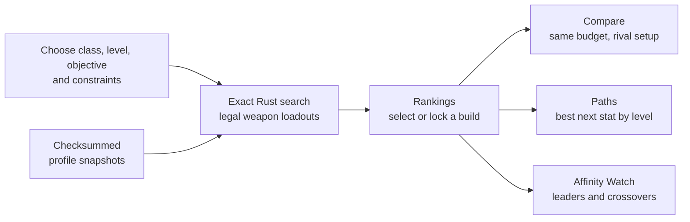

<p align="center">
  
</p>

# Tarnished's Arsenal

[](https://github.com/FueledByRedBull/tarnisheds-arsenal/actions/workflows/ci.yml)
[](https://github.com/FueledByRedBull/tarnisheds-arsenal/actions/workflows/release-package.yml)
[](https://github.com/FueledByRedBull/tarnisheds-arsenal/releases/latest)

**Tarnished's Arsenal** is a Windows desktop optimizer for Elden Ring builds.

It searches across weapons, affinities, Ashes of War, upgrade levels, and stat distributions from one canonical build session, then carries that same session through rankings, comparisons, stat paths, and affinity breakpoints.

```text
weapon x affinity x AoW x upgrade x relevant stat distribution
```

<p align="center">
  <strong>Exact search</strong> &nbsp;·&nbsp; <strong>One shared build session</strong>
  &nbsp;·&nbsp; <strong>Versioned game data</strong> &nbsp;·&nbsp;
  <strong>Reproducible Windows releases</strong>
</p>

## From Question to Answer



The result is not a disconnected calculator output. Selecting a ranked build gives
Compare, Paths, Affinity Watch, exports, and saved presets the same stats, objective,
upgrade policy, assumptions, dataset version, and model version.

## Download

Get the latest Windows build from [Releases](https://github.com/FueledByRedBull/tarnisheds-arsenal/releases/latest).

- `TarnishedsArsenal_<version>_x64_en-US.msi` is the normal installer.
- `TarnishedsArsenal_<version>_portable.exe` is the standalone app and needs no
  adjacent game-data files.
- `TarnishedsArsenal_<version>.zip` bundles the complete release folder for archival
  or offline transfer.

The app uses Microsoft Edge WebView2. The MSI downloads its bootstrapper if the
runtime is missing; the portable executable expects WebView2 to already be installed
(as it normally is on current Windows 10 and Windows 11 systems).

The installer and portable executable both contain checksummed Vanilla 1.16.1 and
The Convergence 3.0.0.1 runtime profiles. Switch profiles from the always-visible
control above the workspace; searches, caches, results, exports, and saved builds
remain isolated by profile. The standalone app does not need an adjacent data
directory, `regulation.bin`, workbook, FMG file, or other support files.
Each release also publishes SHA-256 checksums and a machine-readable build report.

Convergence melee weapon AR, status buildup, passives, affinities, and AoW
compatibility are supported. Ammunition weapons are excluded from Convergence
rankings until arrow/bolt and projectile damage is modeled; this prevents their
incomplete weapon-only values from being compared with melee AR. Convergence AoW
hit/route damage is also intentionally disabled and clearly labeled until
mod-specific motion and sequence data is mapped; Vanilla data is never substituted.

> **Convergence profile: Beta.** The supported weapon model is extracted,
> regression-tested, and differentially validated against the version-bound
> Convergence 3.0.0.1 reference. It is not yet full mod parity: ammunition weapon
> AR and Ash of War hit/route damage remain unavailable, and broader in-game
> verification is still in progress. The application itself remains a normal
> stable release.

Profile mechanics are enforced as data, not UI guesses. Convergence uses one
weapon reinforcement path from +0 through +15, removes Scadutree Blessing scaling,
keeps weapon status buildup fixed across stats/upgrades, and exposes its extended
`S+`/`S++` attribute grades. Its row-0 attack-element
weapons apply every declared nonzero attribute scaling to every nonzero damage
component, matching the mod's in-game weapon panel rather than Vanilla routing.

## What It Answers

Most calculators are built around one exact weapon line. This app is built for open-ended questions:

- What is best if `ARC` must stay above 40?
- When does `Occult` overtake `Blood`?
- Which stat path reaches the selected target most efficiently?
- Which affinity wins if weapon, AoW, class, and level budget stay fixed?
- What happens when the same build is evaluated at every upgrade level?
- In Vanilla, how does Shadow Realm Scadutree scaling change outgoing damage?

## Workspaces

| Workspace | Purpose |
|---|---|
| `Rankings` | Brute-force ranked build search with lockable result stats. |
| `Compare` | Selected build vs rival lines under the same budget and objective. |
| `Paths` | Current + N routing into solved target builds, level by level. |
| `Affinity Watch` | Affinity leader tracking and crossover breakpoints for a fixed setup. |

Every workspace reads from the same active session, so the app does not drift into separate mini-tools with separate assumptions.

## Interface

The current desktop interface uses one consistent selection model: click any
podium card or ranking row to make it the active build, then use the always-visible
Build Detail panel for full combat stats, AR split, route damage, status, stamina,
warnings, and one-click Compare, Paths, and Affinity Watch actions. Lock remains a
separate action because it changes the next search.

Rankings default to a compact comparison table instead of exposing every modeled
field as a column. The active-query strip keeps objective, character level,
reinforcement policy, handedness, game scope, dataset, and active constraints
visible before a search. At the app's narrower supported widths the decorative
podium is removed and the ranked table receives the available space; no capability
is moved into an extra menu.

AR and skill values shown in Rankings and Build Detail are raw model outputs.
Enemy defense and negation are not applied, and affected route details keep
unsupported-effect warnings adjacent to the result.

CSV export has explicit 25, 100, 500, and 2,000-row maximum controls. A
visible result set exports immediately; repeated larger exports reuse the previous
exact result. Files are saved by the system to the user's Downloads folder and
include profile/model provenance, weapon ID and type, requirements, effective
numeric scaling and displayed grades, upgrade-path semantics, stats, AR/status,
and supported AoW route details. Unsupported model values are blank rather than
exported as misleading zeroes.

## Search Model

The optimizer can lock or open each major constraint:

| Input | Locked | Open |
|---|---|---|
| Weapon Type | Search one weapon family | Search all weapon families |
| Weapon | Search one weapon | Search all weapons |
| Affinity | Search one affinity | Search all legal affinities |
| AoW | Search one Ash of War | Search all legal Ashes of War |
| Upgrade | Evaluate exact `+N` | Evaluate the full `+0..+N` range |
| Combat Stats | Reuse exact locked result stats | Optimize within the session budget |

Supported objectives:

- `Max AR`
- `Max Physical AR`
- `Bleed, then AR`
- `AoW First Hit (PvE)`
- `AoW Full Sequence (PvE)`

AoW damage objectives are enabled only when the active profile declares verified
hit and route coverage. They are currently available for Vanilla and unavailable
for the Convergence beta profile.

AoW objectives evaluate one legal route at a time. Inspector and Compare expose
the selected route's ordered actions/hits, damage, status buildup, physical hit
attribute, buff timing, stamina, and any explicit modeling warning. Mutually
exclusive branches are never combined into an impossible total.

The Rust optimizer keeps the search exact. Max AR and Max Physical AR use a bounded
dynamic program over only relevant combat stats, avoiding combinatorial five-stat
enumeration while preserving exhaustive-search results. Other objectives enumerate
only stats that can affect their selected metric. Weapon requirements are folded
into minimum floors first, and inactive stats are filled deterministically only
when the level budget cannot otherwise be consumed.

## Data

The runtime snapshots are generated from local game and mod data, FMG names, and
workbook extraction—not wiki estimates.

Included data covers:

- weapon rows by affinity
- reinforce data
- expanded calc-correct graphs
- exact AoW compatibility rows
- innate weapon passives
- passive overlays by weapon, affinity, and upgrade
- native somber weapon skill attack data
- legal AoW route assignments and explicit exclusions
- numeric PARAM effect-graph data for persistent and per-hit effects
- paired and no-two-hand-bonus behavior
- AoW attack rows for PvE damage objectives
- Shadow of the Erdtree Scadutree blessing attack scaling

Each game profile is an independent versioned, checksummed snapshot. External data
loading is all-or-nothing; a missing, modified, mixed, or unlisted file fails closed
rather than falling back to another profile or embedded file. Vanilla provides the
full supported AoW model. Convergence currently provides verified melee weapon AR,
affinities, passive status, and AoW compatibility while clearly excluding
ammunition weapon AR and disabling AoW hit/route damage until those models are
mapped.

Current boundaries:

- enemy defense, negation, resistance growth, proc explosion damage, and
  poise/stance damage are not modeled
- route status details cover bleed, frost, poison, scarlet rot, sleep, madness, and
  death buildup, separately from proc damage
- route stamina is reported but is not an optimization objective
- temporary buff stacking is not yet modeled as a universal layer

## Development

Requirements:

- Rust stable
- Node.js / npm
- Python 3.12 for validation and data tooling

Install Python validation helpers when working on data validation, benchmarks, or
release packaging:

```powershell
python -m pip install -r requirements-validation.txt
```

Run the desktop app:

```powershell
cd apps/desktop
npm install
npm run dev
npm run tauri dev
```

Validate the main paths:

```powershell
cargo test --manifest-path core/er_optimizer_core/Cargo.toml
cargo test --manifest-path apps/desktop/src-tauri/Cargo.toml
python tools/phase4/validate_phase4.py
python tools/phase4/validate_external_calculator.py  # optional network comparison
cd apps/desktop
npm test
npm run build
npm run test:e2e
```

Measure release-mode optimizer phases without turning shared-runner noise into a
release failure:

```powershell
python tools/phase4/benchmark_optimizer_phases.py `
  --warmups 1 --repeats 5 `
  --output dist/benchmarks/optimizer-phases.json
```

This reports preparation, scoring/top-k, and final materialization separately. See
[the performance guide](docs/performance.md) for workflow benchmarks and advisory
baseline comparison.

Build a Windows release package:

```powershell
python tools/phase4/package_release.py
```

The release helper runs core and Tauri tests, builds and installs the
release-profile local validation binding, runs data validation, installs
frontend dependencies, builds the Tauri app, and writes
`dist/TarnishedsArsenal_<version>` with the MSI, standalone executable, checksums,
and build report, plus `dist/TarnishedsArsenal_<version>.zip`. See
[the release guide](docs/releasing.md) for the tag-driven release process.

## Refresh Data

The profile-aware extractor generates Vanilla and Convergence as separate atomic
snapshots from their local `regulation.bin` files. Convergence also requires its
weapon/skill name FMGs, version file, and committed player-availability reference;
the source game/mod files and WitchyBND stay ignored under `data/raw/`. The offline
release validator compares every modeled Convergence weapon and status value to
that version-bound reference.

See [`tools/phase1/README.md`](tools/phase1/README.md) for the exact commands and
required inputs for both profiles. Extraction validates a sibling staging snapshot,
then promotes its data files and installs the manifest last. Do not run the
lower-level derivation scripts individually for a release snapshot.

## Repository Layout

| Path | Role |
|---|---|
| `apps/desktop` | Tauri, React, and TypeScript desktop app. |
| `core/er_optimizer_core` | Rust optimizer and optional PyO3 validation binding. |
| `data/phase1` | Committed Vanilla runtime snapshot. |
| `data/profiles/convergence` | Committed Convergence runtime snapshot. |
| `tools/phase1` | Extraction and data refresh tooling. |
| `tools/phase4` | Validation, benchmarking, and release packaging. |
| `docs/architecture` | Runtime identity, cache, job, and snapshot invariants. |
| `docs/design` | Current design references for optimizer and release behavior. |
| `docs/release-notes` | Per-version release notes and GitHub release links. |
| `docs/validation` | Immutable, release-specific correction and verification evidence. |

See [`tools/README.md`](tools/README.md) for the phase-tooling directory split,
[`docs/design/optimizer-overview.md`](docs/design/optimizer-overview.md) for the
current optimizer design reference,
[`docs/architecture/runtime-invariants.md`](docs/architecture/runtime-invariants.md)
for cross-boundary contracts, and [`CHANGELOG.md`](CHANGELOG.md) for the release-notes
index.

## License

Code is available under the [MIT License](LICENSE).

Elden Ring IP belongs to FromSoftware / Bandai Namco. This is fan-made tooling and does not ship the game itself.
